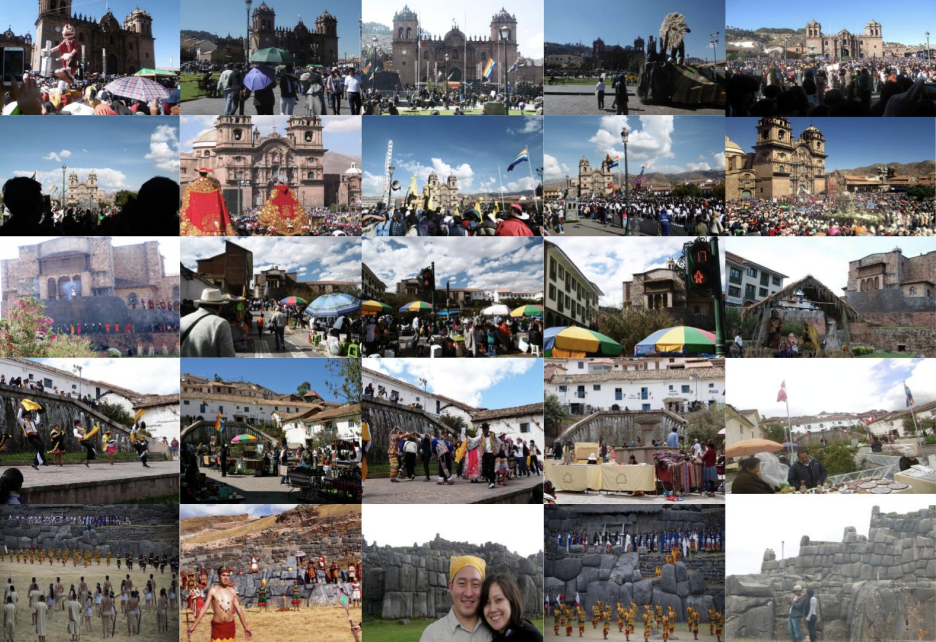
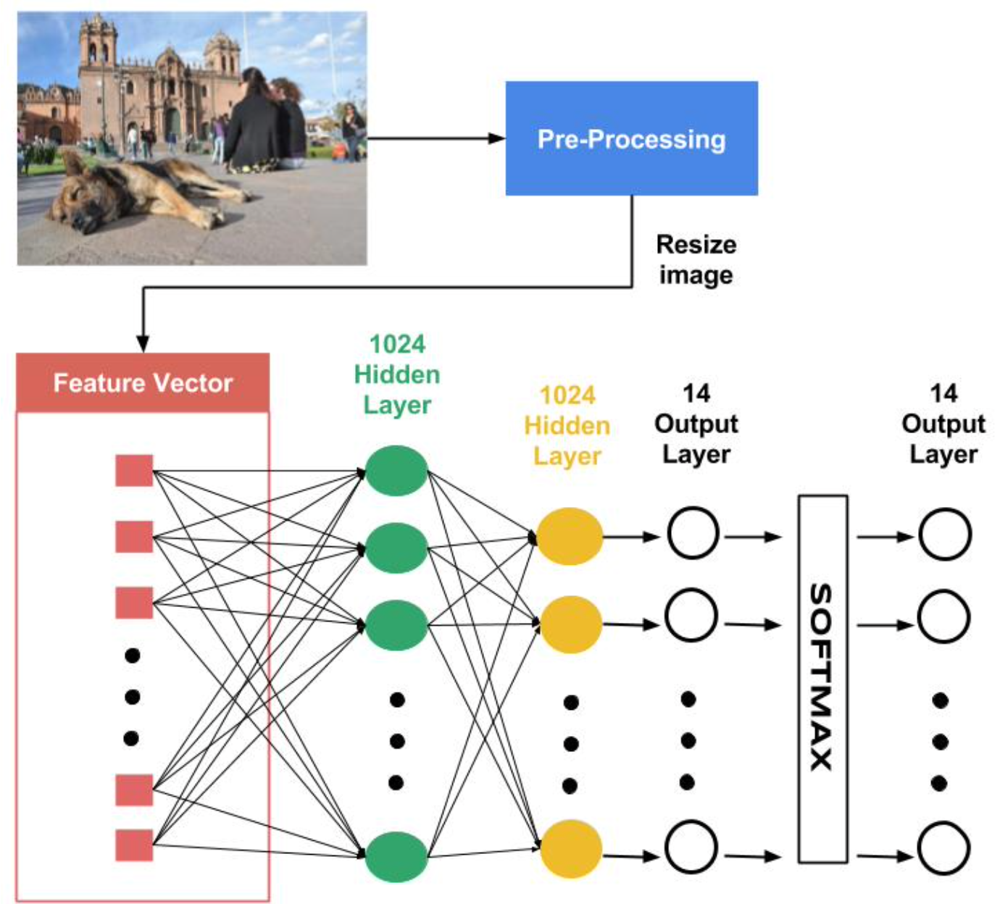

# Towards Accurate Building Recognition Using Convolutional Neural Networks

This repository implements our paper [*Towards Accurate Building Recognition Using Convolutional Neural Networks*](https://ieeexplore.ieee.org/abstract/document/8079686) and my thesis [*Evaluación de Técnicas de Aprendizaje de Máquina para la Identificación de Imágenes de Edificios Históricos de la Ciudad del Cusco Basado en Bag-of-Words y Redes Neuronales Convolucionales*](https://drive.google.com/file/d/1jEvaA3Q-oVf_AGPI2F1Sjf-Lj9nI-BQv/view?usp=sharing) (Spanish version).

```
@inproceedings{farfan2017towards,
  title={Towards accurate building recognition using convolutional neural networks},
  author={Farfan-Escobedo, Jeanfranco D and Enciso-Rodas, Lauro and Vargas-Mu{\~n}oz, John E},
  booktitle={2017 IEEE XXIV International Conference on Electronics, Electrical Engineering and Computing (INTERCON)},
  pages={1--4},
  year={2017},
  organization={IEEE}
}
```
```
@phdthesis{farfan2018evaluacion,
  title={Evaluacion de tecnicas de aprendizaje de maquina para la identificacion de imagenes de edificios historicos de la ciudad del Cusco basado en Bag-Of-Words y Redes Neuronales Convolucionales},
  author={Farfan-Escobedo, Jeanfranco David},
  year={2018},
  school={Tesis]. UNIVERSIDAD NACIONAL DE SAN ANTONIO ABAD DEL CUSCO}
}
```


We worked on a project that aims to recognize building historic from images in the city of Cusco in Peru. Building recognition from images is a challenging task since pictures can be taken from different angles and under different illumination conditions. An additional challenge is to differentiate buildings with a similar architectural design. Similarly, many events are held in the city of Cusco, such as Inti Raymi, Corpus Christi, and others. These events create occlusions; that is, transient objects (people, vehicles, and others) obstruct the image being analyzed. Generally, historic buildings serve as the background for various events.



We compare the baseline method Bag-of-Words (We using SIFT and SURF to feature extraction) and the proposed CNN-based method (We propose a transfer learning approach using the models Vgg16, Vgg19, Inception-V3 and Xception to feature extraction). 



This repo explains dependencies, data preprocessing, training and testing for every module of our network:

## Dependencies
The implementation has been tested under a Mac OS environment with:
* Python (V2.7)
* Tensorflow  (V1.0.0)
* Keras  (V2.0.2)
* Matplotlib (V2.0.0)
* Opencv  (V2.4.11)
* NumPy  (V1.12.0)
* SciPy (V0.18.1)
* SciKitLearn (V0.18.1)

## Dataset

  - [First Version](https://drive.google.com/drive/folders/0BzMfOBUQtl7dMHJfSGgtVTRZRDQ?usp=sharing). This consists of 2000 images of 14 different historical buildings of the city of Cusco. Next, the class number and the name of the historic building that corresponds to it is presented
  
    | Class label    | Building name   | Image number|
    | :---:         |     :---:       | :---:|
    | 01    |  Casa del Inca Garcilaso     |  108    |
    | 02      | Catedral del Cusco       |159    |
    | 03      | La Compañia de Jesus       |176    |
    | 04    | Coricancha     |  147|
    | 05      | Cristo Blanco       |146|
    | 06      | Templo de la Merced       |142|
    | 07    | Mural de la Historia Inca    |  137|
    | 08    | Paccha de Pumaqchupan   |  114    |
    | 09      |  Pileta de San Blas      |139    |
    | 10      | Inca Pachacutec      |129    |
    | 11    | Sacsayhuaman     |  190|
    | 12      | Iglesia de San Francisco       |135|
    | 13      |  Iglesia de San Pedro     |146|
    | 14      |Iglesia de Santo Domingo    |  132|
  
  - [Second Version](https://drive.google.com/open?id=0B_aI63-sG2GwVWhKR1Q4bXYxZUk). This consists of 4560 images of 14 different historical buildings of the city of Cusco. Next, the class number and the name of the historic building that corresponds to it is presented

    | Class label    | Building name   | Image number|
    | :---:         |     :---:       | :---:|
    | 01    |  Casa del Inca Garcilaso     |  200    |
    | 02      | Catedral del Cusco       |600    |
    | 03      | La Compañia de Jesus       |600    |
    | 04    | Coricancha     |  570|
    | 05      | Cristo Blanco       |200|
    | 06      | Templo de la Merced       |260|
    | 07    | Mural de la Historia Inca    |  200|
    | 08    | Paccha de Pumaqchupan   |  200    |
    | 09      |  Pileta de San Blas      |320    |
    | 10      | Inca Pachacutec      |300    |
    | 11    | Sacsayhuaman     |  350|
    | 12      | Iglesia de San Francisco       |250|
    | 13      |  Iglesia de San Pedro     |280|
    | 14      |Iglesia de Santo Domingo    |  230|

## Data Preparation

- **Format**

  Change format to class_imagenumber.jpg. If you use Ubuntu you can execute the following sentence:
      
  //enter to folder catedral and run; output 01_0001.jpg, 01_0002.jpg, ....
      
  ls *.jpg | awk 'BEGIN{ class=1; photo=1; }{ printf "mv \"%s\" %02d_%04d.jpg\n", $0, class, photo++ }' | bash
      
  //enter to folder coricancha and run; output 02_0001.jpg, 02_0002.jpg, ....
   
  ls *.jpg | awk 'BEGIN{ class=2; photo=1; }{ printf "mv \"%s\" %02d_%04d.jpg\n", $0, class, photo++ }' | bash
      
  //enter to folder garcilaso and run; output 03_0001.jpg, 01_0003.jpg, ....
      
  ls *.jpg | awk 'BEGIN{ class=3; photo=1; }{ printf "mv \"%s\" %02d_%04d.jpg\n", $0, class, photo++ }' | bash
  
  ...
  
- **Join Data**
  
  Copy all the images of the folders to a new folder (where we will leave all the images), we recommend the name of "dataset_cus".
  
- **Split Train and Test**

  We created N folders and randomdly split the dataset in train and test. Run script
  
  python split_dataset.py ~/Path-to-original-dataset/ nsplits perc_train ~/Path-to-output-dataset/
  
  Where:
  
   - ~/Path-to-original-dataset/ : Directory of input images(dataset_cus)
    
   - nsplits : Number of folders splits
    
   - perc_train : Percentage of train samples
    
   - ~/Path-to-output-dataset/ : Output path
    
## Bag-of-Words

<p align="center"></p>
    
- **Build Codebook**

  We used SURF to feature extraction. However, if you want to use another algorithm (for example: SIFT). You must change the line of code 'desc_method = cv2.SURF()' for 'desc_method = cv2.SIFT()' in script bovw_utils.py. Finally, to create the codebook, you need to run.
  
  python codebook.py ~/Path-to-train-dataset/ codebook_size codebook_method ~/Path-to-output-dataset/
  
  Where:
  
   - ~/Path-to-train-dataset/ : Directory of input images(train)
    
   - codebook_size : Size of the dictionary
    
   - codebook_method : Codebook method ('random, kmeans, st_kmeans, fast_st_kmeans). We we recommend using fast_st_kmeans because it is faster
    
   - codebook_filename : Output file(*.npy)

- **Build Bag-of-visual-Words**

  This script needs to be executed twice to extract bag of visual words. one for the train data and the other for the test data.
    
  python bovw.py ~/Path-to-train-dataset-train/ codebook_filename output_bovw_filename_train output_labels_filename_train
   
  Where:
  
    - ~/Path-to-train-dataset/ : Directory of input images(train)
    
    - codebook_filename : Codebook file (*.npy)
    
    - output_bovw_filename_train : Output file(*.npy) with visual words
    
    - output_labels_filename_train : Output file(*.npy) with labels of visual words
   
   python bovw.py ~/Path-to-train-dataset-test/ codebook_filename output_bovw_filename_test output_labels_filename_test
    
    Where:
  
    - ~/Path-to-train-dataset-test/ : Directory of input images(test)
    
    - codebook_filename : Codebook file (*.npy)
    
    - output_bovw_filename_test : Output file(*.npy) with visual words
    
    - output_labels_filename_test : Output file(*.npy) with labels of visual words

- **Classification**

  We use four different classification methods. Support Vector Machine, Random Forest and k Nearest Neighbor are in the script classify_train_test.py. 
  
  python classify_train_test.py dataset_train_filename labels_train_filename dataset_test_filename labels_test_filename method output_filename
  
  Where:
  
    - dataset_train_filename : equals to output_bovw_filename_train, Dataset train file name (*.npy)
    
    - labels_train_filename : equals to output_labels_filename_train, Label train filename (*.npy)
    
    - dataset_test_filename : equals to output_bovw_filename_test, Dataset test file name (*.npy)
    
    - labels_test_filename : equals to output_labels_filename_test, Label test filename (*.npy)
    
    - method : Classifier (svm, linear_svm, rf, knn), where svm is equals to SVM with kernel RBF and linear_svm is equals to SVM with kernel lineal
    
    - output_filename : Predicted output filename(*.npy)
    
  While Neural Network is executed in script cnn_test_tinc3.py(you can modify parameters such as the number of neurons, number of layers and others).
    
  python classify_train_test.py file_path_train file_path_train_cls file_path_test file_path_test_cls file_path_save_model

  Where:
  
    - file_path_train : equals to output_bovw_filename_train, Dataset train file name (*.npy)
    
    - file_path_train_cls : equals to output_labels_filename_train, Label train filename (*.npy)
    
    - file_path_test : equals to output_bovw_filename_test, Dataset test file name (*.npy)
    
    - file_path_test_cls : equals to output_labels_filename_test, Label test filename (*.npy)
    
    - file_path_save_model : Predicted output filename(*.ckpt)

## Transfer Learning

<p align="center"></p>

- **Compute Transfer Values**

We use different pre-trained models of convolutional neural networks, these architectures were provided by the framework [Keras](https://github.com/fchollet/deep-learning-models) ([VGG16, VGG19](https://arxiv.org/abs/1409.1556), [Xception](https://arxiv.org/abs/1610.02357)) and [Magnus Erik Hvass Pedersen](https://github.com/Hvass-Labs/TensorFlow-Tutorials)([Inception-V3](https://arxiv.org/abs/1512.00567)).

  - VGG16, VGG19 and Xception.
  
  Pre-trained weights can be automatically loaded upon instantiation. Weights are automatically downloaded if necessary, and cached locally in ~/.keras/models/.
   
  - Inception-V3
  
 First, you must download the pre-trained model of http://download.tensorflow.org/models/image/imagenet/inception-2015-12-05.tgz. Second, unzip the model within the 'CNN-Transfer Learning' folder. Third, modify the model's path in the 'inception.py' file, for example: data_dir = "/home/jeanfranco/Documents/deep-learning-models_proy/inception-2015-12-05/".
 
 you need to execute the following script twice, one for the train data and the other for the test data. 
 
 To train.
 
  python compute_transfer_values.py ~/Path-to-train-dataset-train/ dataset_type model_type data_augmentation output_data_train output_cls_train
  
   Where:
    
   - ~/Path-to-train-dataset-train/ : Directory of input images(train)
    
   - dataset_type : choose method ('train',' test'), we recommend train
    
   - model_type : choose model type ('vgg16', 'vgg19', 'resnet', 'xception','inception')
    
   - data_augmentation : choose ('si', 'no')
   
   - output_data_train : Output transfer values (.npy)
   
   - output_cls_train : Output classes (.npy)
  
  To test.

  python compute_transfer_values.py ~/Path-to-train-dataset-test/ dataset_type model_type data_augmentation output_data_test output_cls_Test
  
   Where:
  
   - ~/Path-to-train-dataset-train/ : Directory of input images(test)
   
   - dataset_type : choose method ('train',' test'), we recommend test
    
   - model_type : choose model type ('vgg16', 'vgg19', 'resnet', 'xception','inception')
    
   - data_augmentation : choose ('no')
   
   - output_data_test : Output transfer values (.npy)
   
   - output_cls_Test : Output classes (.npy)
   
 - **Classification**

  We use four different classification methods. Support Vector Machine, Random Forest and k Nearest Neighbor are in the script classify_train_test.py. 
  
  python classify_train_test.py output_data_train output_cls_train output_data_test output_cls_Test method output_filename
  
  Where:
  
   - output_data_train : Dataset train file name (*.npy)
    
   - output_cls_train : Label train filename (*.npy)
    
   - output_data_test : Dataset test file name (*.npy)
    
   - output_cls_Test : Label test filename (*.npy)
    
   - method : Classifier (svm, linear_svm, rf, knn), where svm is equals to SVM with kernel RBF and linear_svm is equals to SVM with kernel lineal
    
   - output_filename : Predicted output filename(*.npy)
    
  While Neural Network is executed in script cnn_test_tinc3.py(you can modify parameters such as the number of neurons, number of layers and others).
    
  python classify_train_test.py output_data_train output_cls_train output_data_test output_cls_Test file_path_save_model

  Where:
  
   - output_data_train : Dataset train file name (*.npy)
    
   - output_cls_train : Label train filename (*.npy)
    
   - output_data_test : Dataset test file name (*.npy)
    
   - output_cls_Test : Label test filename (*.npy)
    
   - file_path_save_model : Predicted output filename(*.ckpt)
   
## Prediction

  We develop a prediction from the new trained model. That is, we identify the category of belonging to a new image of a historic building in the city of Cusco. 
  
  We have three cells in 'Prediction_models.ipynb', The first line, the machine learning algorithm is applied
 neural network, in the method 'main' 'saver = tf.train.import_meta_graph('model.ckpt.meta')' depends on the name of the previously generated file. The second line, represents a visualization of applying data augmentation. Finally, the machine learning algorithm is Support Vector Machine. We recommend using the last cell during the prediction process, because it presents the best results during this stage.
   
## Publication
 
 You can review our paper, published in the IEEE Xplore Digital Library
 
 - Tittle: [Towards accurate building recognition using convolutional neural networks](http://ieeexplore.ieee.org/document/8079686/)
 
 - Authors: 
  
    - Jeanfranco D. Farfan-Escobedo. Escuela Profesional de Ingeniería Informática y de Sistemas, Universidad Nacional de San Antonio Abad del Cusco, Peru
  
    - Lauro Enciso-Rodas. Escuela Profesional de Ingeniería Informática y de Sistemas, Universidad Nacional de San Antonio Abad del Cusco, Peru
  
    - John E. Vargas-Muñoz. Institute of Computing - University of Campinas, Campinas, Brazil
 
## Citation
 
 Finally, if you use the database or the code, do not forget to reference this work.
 
 @inproceedings{farfan2017towards,
  title={Towards accurate building recognition using convolutional neural networks},
  author={Farfan-Escobedo, Jeanfranco D and Enciso-Rodas, Lauro and Vargas-Mu{\~n}oz, John E},
  booktitle={Electronics, Electrical Engineering and Computing (INTERCON), 2017 IEEE XXIV International Conference on},
  pages={1--4},
  year={2017},
  organization={IEEE}
}

  
  
   
    


 
              
